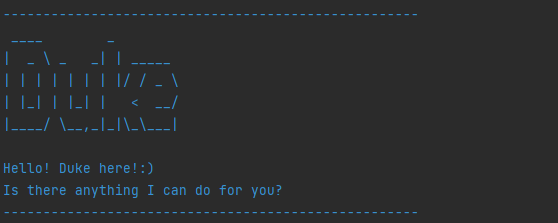

# Duke User Guide
Duke is a ***an optimized Command Line Interface (CLI) application used for managing tasks*** .

* [Quick Start](#quick-start)
* [Command Summary](#command-summary)
* [Features](#features)
  * [Lists all tasks: `list`](#lists-all-tasks-list)
  * [Delete a task in the list: `delete`](#delete-a-task-in-the-list-delete)
  * [Mark a task as done: `mark`](#mark-a-task-as-done-mark)
  * [Unmark a task on the list: `unmark`](#unmark-a-task-on-the-list-unmark)
  * [Add a 'todo' task: `todo`](#add-a-todo-task-todo)
  * [Add an 'event' task: `event`](#add-an-event-task-event)
  * [Add a 'deadline' task: `deadline`](#add-a-deadline-task-deadline)
  * [Find tasks in the list: `find`](#find-tasks-in-the-list-find)
  * [Exit the program: `bye`](#exit-the-program-bye)

##Quick Start

1. Ensure you have Java`11`or above installed in your computer.
2. Download the latest`Duke.jar`from [here](https://github.com/limjierui/ip/releases).
3. Move the file to the folder you want to use.
4. Open a command-line interface and navigate to folder you have chosen. You should see the`Duke.jar`file.
5. Type`java -jar Duke.jar`to run the program. The program should start up in a few seconds and show:

6. Enter the commands you wish to execute and start managing your tasks!
7. Refer to [Command Summary](#Command Summary) below for details of each command

##Command Summary

| Commands | Format, Example                                                                                             |
|----------|-------------------------------------------------------------------------------------------------------------|
| list     | `list`  To list the items                                                                               | 
| delete   | `delete [TASK INDEX]` e.g delete 2  To ***remove*** the second task on your list                        |
| mark     | `mark [TASK INDEX]` e.g mark 2  To ***mark*** the second task on your list as done                      |
| unmark   | `unmark [TASK index]` e.g unmark 2  To ***unmark*** the fourth task on your list                        |
| todo     | `todo [DESCRIPTION]` e.g todo work   To add a ***todo*** task.                                          |
| event    | `event [DESCRIPTION] /at [DATE]` e.g event attend class /at Monday 6pm  To add a ***event*** task.      |
| deadline | `deadline [DESCRIPTION] /by [DUE DATE]` e.g deadline project /by Tuesday  To add a ***deadline*** task. |
| find     | `find [KEYWORD]` e.g find lecture  To ***find*** tasks according to the keyword.                        |
| bye      | `bye`  To ***exit*** the program.                                                                       |

# Features

### Lists all tasks: `list`
Lists all the tasks in the task list.  
Format: `list` 
Example:  
   

### Delete a task in the list: `delete`
Deletes a specific task in the list using the index specified.  
Format: `delete [TASK INDEX]`  
Example: 'delete 2' - To delete second task in the list.  
   

### Mark a task as done: `mark`
Marks a specific task in the list as done using the index specified. 
Format: `mark [TASK INDEX]`  
Example: 'mark 2' - To mark second task in the list as done.  
   

### Unmark a task on the list: `unmark`
Unmarks a specific task in the list as not done using the index specified. 
Format: `unmark [TASK INDEX]`  
Example: 'unmark 2' - To unmark second task in the list as not done.  
   

### Add a 'todo' task: `todo`
Adds a todo task to the list. No date/time is required for this command. 
Format: `todo [DESCRIPTION]`  
Example: 'todo work' - To add a todo work task to the list.  
   

### Add an 'event' task: `event`
Adds an event task to the list. Date/time is required for this command. 
Format: `event [DESCRIPTION] /at [DATE]`  
Example: 'event attend class /at Monday 6pm' - To add an event at Monday 6pm task to the list.  
   

### Add a 'deadline' task: `deadline`
Adds a deadline task to the list. Date/time is required for this command. 
Format: `deadline [DESCRIPTION] /by [DATE]`  
Example: 'deadline project /by Tuesday' - To add a project with deadline by Tuesday task to the list.  
   

### Find tasks in the list: `find`
Finds all the tasks that contains the keyword given.  
Format: `find [KEYWORD]`  
Example: 'find book' - To find tasks that have the keyword 'book' in it.  
   

### Exit the program: `bye`
Exits the program. All tasks added will be saved in the hard disk.  
Format: `bye`  
Example:  
   